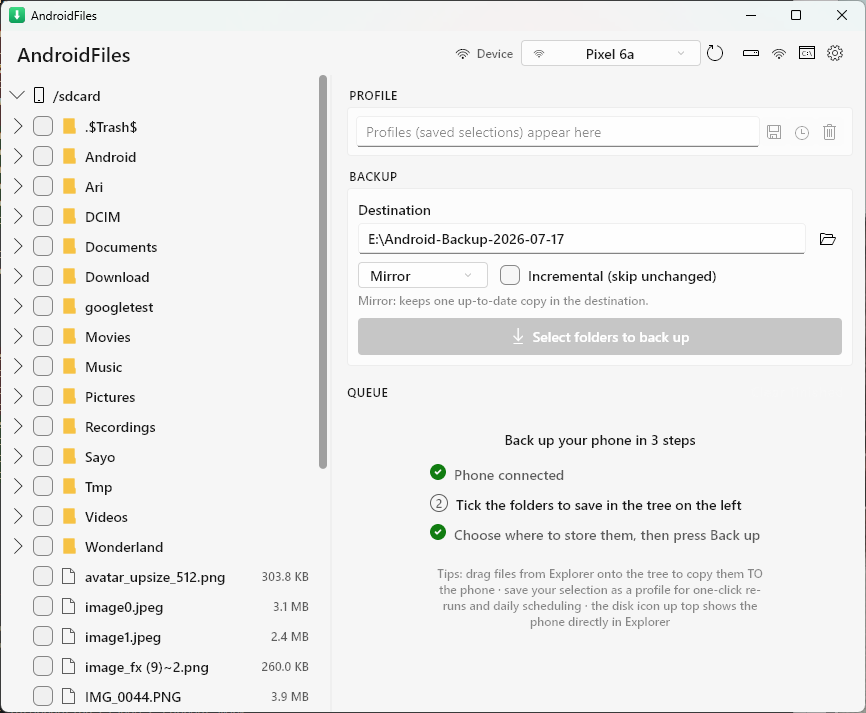

# AndroidFiles

**Fast, reliable Android phone backups for Windows — over ADB, not MTP.**



Windows' built-in phone access (MTP) copies file-by-file, stalls on large
folders, and gives up halfway. AndroidFiles streams whole folders off your
phone as a single continuous transfer over ADB — saturating the USB link —
and verifies what landed.

## Features

- **Fast backups** — folders stream as one tar pipe (`adb exec-out tar`),
  no per-file round-trips; typically several times faster than MTP for
  large folders, with live progress, speed, ETA, and pause/resume
- **Incremental** — re-runs transfer only changed files (size+mtime
  manifest diff); an unchanged 50 GB folder re-backs-up in seconds moving
  0 bytes
- **Mirror or Snapshot layouts** — keep one up-to-date copy, or a dated
  folder per run where unchanged files are NTFS-hardlinked (full history at
  almost no extra disk cost)
- **Verified** — file counts checked after every run; optional deep verify
  compares md5 of every file on both sides
- **Explorer drive** — mount the phone as a drive letter (WinFsp) for
  browsing and grabbing files; optional writable mode (off by default,
  guarded by a warning)
- **Restore** — drag files from Explorer onto the app to push them back to
  the phone
- **Profiles & scheduling** — save folder selections, re-run in one click,
  or schedule daily backups via Windows Task Scheduler with toast
  notifications
- **Wireless** — pair by scanning a QR code (like Android Studio);
  already-paired phones on your network reconnect automatically
- **Self-contained** — if adb isn't installed, the app downloads Google's
  platform-tools automatically
- **Correct with non-ASCII filenames** — tar extraction is done natively
  (Windows' bundled bsdtar mangles UTF-8 names)

## Install

**Installer (recommended):** download `AndroidFiles-win-Setup.exe` from
[Releases](../../releases/latest) and run it. It installs per-user (no admin
prompt) and updates itself from GitHub — when a new version ships, the app
offers to download and apply it in place.

**Portable:** prefer no installer? Grab the ZIP from the same page, extract it
anywhere, and run `android_files.exe`. Portable builds don't self-update, but
the app still tells you when a new version is out.

Then, on the phone: enable **Developer options → USB debugging**, plug in, and
accept the prompt. (Or pair wirelessly via the Wi-Fi button — no cable.)

**Notes**

- Windows SmartScreen may warn on first run because the binaries are not
  code-signed (see [Code signing](#code-signing)). Click
  *More info → Run anyway*.
- The **Explorer drive** feature additionally needs the free
  [WinFsp](https://winfsp.dev/rel/) driver installed. Everything else works
  without it.
- adb is bundled-on-demand: if missing, it is downloaded from Google on
  first start.
- On launch the app asks GitHub whether a newer release exists. In an
  installed build it offers to download and apply the update in place (via
  [Velopack](https://velopack.io/)); the portable build just links you to the
  release. Turn the check off under **Settings → Check GitHub for new versions
  on launch**.

## Quick start

1. Tick the folders to back up in the tree on the left.
2. Pick a destination folder on your PC.
3. Press **Back up**. That's it — re-running later only transfers changes.

## Status

AndroidFiles is early software (v0.1.0) and in active use, but it reads
from — and, in writable-drive and restore modes, writes to — your phone.
**Keep at least one independent backup of anything you can't afford to lose**,
and leave the Explorer drive read-only unless you specifically need to change
files on the device. Provided as-is, with no warranty (see [LICENSE](LICENSE)).

## Code signing

AndroidFiles is free and MIT-licensed. Releases are not code-signed yet, which
is why Windows SmartScreen warns the first time you run it.

Signing is worth doing, but not for the reason it's usually sold: Microsoft is
explicit that a certificate does not make the warning disappear on its own —
a new signed app is still "unrecognized" until it builds reputation. What
signing buys is that the reputation *accumulates across releases* instead of
resetting to zero with every new version, the way it does for unsigned builds.

Sorting this out is on the list — [SignPath Foundation](https://signpath.org/)
signs open-source projects for free, and there are cheap certificates if that
doesn't work out. This section will say something concrete once it is.

## Building from source

Prereqs: [Flutter](https://flutter.dev) (stable), Visual Studio 2022 Build
Tools with the C++ workload, and — for the drive host — the
[.NET SDK 9](https://dotnet.microsoft.com/) plus [WinFsp](https://winfsp.dev/rel/)
(its installer provides the .NET binding the build references).

```powershell
flutter pub get
flutter build windows --release
dotnet publish drive -c Release -o drive\publish   # optional: Explorer drive host
```

Run the tests with `flutter test`. There is also a live end-to-end suite
(`flutter test test/live_backup_manual.dart`) that exercises real transfers
against a connected device using a throwaway folder.

Note: `third_party/fluent_ui` is a vendored copy of
[fluent_ui](https://pub.dev/packages/fluent_ui) (BSD-3) carrying a small
crash fix in the ComboBox popup; `pubspec.yaml` overrides the dependency to
it. Project notes and the roadmap live in [NOTES.md](NOTES.md).

## License

[MIT](LICENSE). Bundles [fluent_ui](https://pub.dev/packages/fluent_ui)
(BSD-3-Clause, vendored under `third_party/`). The optional Explorer-drive
feature uses [WinFsp](https://winfsp.dev) (GPLv3 with FLOSS exception),
which users install separately.
